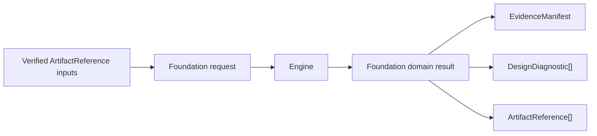

# TimingEngine Design

## Purpose

Canonical timing data, MMMC static timing analysis and signal-integrity contracts.

## Responsibility boundary

This package owns the schemas and engine protocols listed in its public products. It must remain usable without UI state and without the Xcircuite runtime.

## Non-responsibilities

- Generating parasitics
- Mutating placement or routing
- Declaring final release approval

## Dependency direction

```text
standard artifacts / canonical references
                 ↓
CircuiteFoundation artifact / evidence boundary
                 ↓
TimingEngine protocols and result schemas
                 ↓
native or external-tool backends
                 ↓
Xcircuite stage adapters
                 ↓
DesignFlowKernel and .xcircuite artifacts
```

Backends may depend on lower-level data packages. This package must never import `Xcircuite` or `circuit-studio`.

## Trust model

Kernel availability, corpus validation, oracle correlation, process-scoped qualification and release approval are distinct states. The package reports capability and evidence; Xcircuite and ToolQualification apply flow policy.

## Artifact requirements

All outputs are immutable run artifacts with format, digest, producer metadata and the input design/PDK revision needed to reproduce the result.

## CircuiteFoundation boundary

Native STA and signal-integrity execution uses CircuiteFoundation as the public cross-domain boundary:



Domain payloads remain owned by TimingEngine. Evidence, artifact identity and diagnostic vocabulary come from CircuiteFoundation, so an Agent or human reviewer can inspect execution provenance without depending on UI state. The existing Xcircuite envelope is retained only inside the explicit compatibility adapter until the Xcircuite stage executors are migrated.
