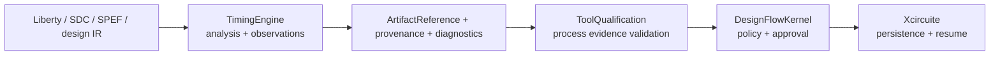

# TimingEngine Design

## Purpose

TimingEngine owns canonical timing data, MMMC static timing analysis, signal-integrity analysis, retained observations and independent-oracle correlation.

## Responsibility boundary

TimingEngine can report that a retained corpus or oracle comparison agrees for a declared scope. It does not decide that a tool is production-qualified and does not approve a release. `ToolQualification` validates raw process evidence. `DesignFlowKernel` applies flow policy and approval. `Xcircuite` owns concrete workspace and run persistence.

## Trust model

The following states are independent:

| State | Owner | Meaning |
|---|---|---|
| Execution completed | TimingEngine backend | A typed analysis result was produced |
| Corpus replay valid | TimingEngine | Retained expected observations were reproduced |
| Oracle correlation passed | TimingEngine verifier | Raw native and oracle outputs agree within a declared tolerance |
| Process evidence accepted | ToolQualification | Raw evidence was reconstructed and validated for a process scope |
| Flow approved | DesignFlowKernel | Policy and human approval permit promotion |

Persisted decision fields are not trusted. `TimingEvidenceAssessment.outcome` is derived from findings. External correlation is accepted only after workspace containment, digest, byte-count, producer, invocation, input and metric reconstruction checks.

The OpenSTA execution boundary does not trust a caller-declared tool identity. The adapter resolves the executable, validates that it is a regular executable file, measures its SHA-256, verifies its reported version, and detects binary or file-metadata mutation after the version probe and analysis process. The observed digest is stored as the supporting tool producer build so ToolQualification can bind the result to its independently verified `binaryDigest`.

The checked-in Sky130A directory is an input manifest, not a foundry corpus. Its required Liberty file is deliberately external; absence or digest drift is reported as incomplete PDK evidence. No checked-in decision artifact may convert that missing input into qualification.

## Artifact boundary

Correlation artifacts must use workspace-relative `ArtifactLocation` values. The caller supplies one explicit workspace root. Symlink-resolved files outside that root are rejected. Native and oracle outputs must retain the same input artifact identities and an independent oracle executable identity. A declared executable version without a matching measured digest is not production evidence.

## Dependency direction

TimingEngine depends on `CircuiteFoundation` for cross-domain artifacts, evidence, diagnostics and engine protocols. It does not import Xcircuite or circuit-studio. Production trust consumers depend on ToolQualification's validation protocol and inject an asynchronous verified artifact reader.

## Non-responsibilities

- Parasitic extraction
- Placement or routing mutation
- Tool self-qualification
- Flow approval, waiver, release or resume policy
- Concrete `.xcircuite` storage
