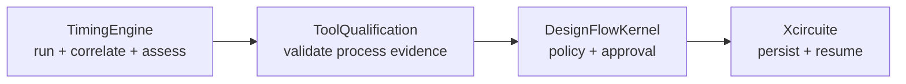

# TimingEngine Goal Status

## Summary

The declared native timing subset, retained corpus, external OpenSTA execution and raw correlation reconstruction are implemented. TimingEngine now reports a derived evidence assessment instead of a self-issued production qualification.

## Ownership

| Gate | Status | Evidence |
|---|---|---|
| Native STA/SI subset | Complete | Typed APIs, CLI and focused tests |
| Retained corpus | Complete | Positive, blocked and SI cases |
| External process safety | Complete | Timeout, process-tree cleanup, create-only per-run workspace, private input snapshots, and structured failures |
| Executable identity | Complete | Resolved regular-file validation, measured version, private executable snapshot, before/after SHA-256 mutation detection, and producer-build binding |
| External raw correlation | Complete | Workspace-relative artifacts, digest/size checks, identity/input binding and metric reconstruction |
| Evidence assessment | Complete | Outcome derived from findings; serialized verdict injection is ignored |
| PDK observation | Complete | Manifest and asset digests rebuilt under an explicit workspace root |
| ToolQualification handoff | Complete | Filesystem and in-memory timing readers directly conform to the async verified artifact-reader protocol |
| Flow approval/release | External responsibility | DesignFlowKernel policy and human approval |

## Function matrix

| Function | Implementation | Current boundary |
|---|---|---|
| Liberty parsing | Native deterministic subset | Unsupported semantics block |
| SDC parsing | Clocks, IO constraints, exceptions and groups | Unsupported commands block |
| SDF | Import/export | Declared subset |
| Timing graph | JSON IR and structural Verilog subset | Stable identity retained |
| MMMC STA | Setup/hold across requested modes/corners | Advanced statistical variation remains open |
| Signal integrity | SPEF coupling delta delay/noise ratio | Waveform-resolved noise remains open |
| Correlation | Native/reference/OpenSTA | Reconstructed from raw retained outputs |
| Production trust | Not owned by TimingEngine | ToolQualification validates; DesignFlowKernel approves |

## Verification

- `swift build`
- focused `CorpusTests` through `xcodebuild` with a 30-second external timeout
- artifact and executable tampering tests for corpus and oracle output
- seven focused external-adapter process tests covering invalid invocation, version mismatch, non-executable input, invalid run identity, exact executable SHA-256 provenance, and mutation detection
- persisted assessment verdict injection test
- workspace-relative containment and digest reconstruction through the correlation verifier

## Remaining limitations

- Broader PVT, cell-family, parasitic and SI corpus coverage is required for signoff-oriented use.
- The independent OpenSTA binary is an environment prerequisite.
- The retained Sky130A TT profile is evidence for that scope only.
- Foundry signoff equivalence is not claimed.

This file records implementation maturity, not a production qualification decision.
