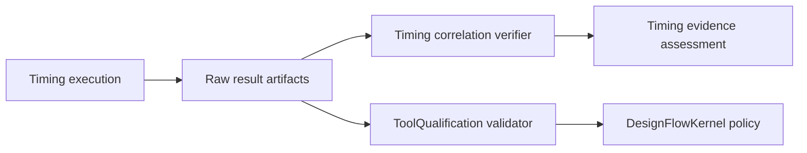

# TimingEngine Implementation Plan

## Completed foundation

1. Liberty, SDC, SDF and SPEF parsing
2. Canonical timing graph and constraints
3. MMMC setup/hold analysis
4. Coupling-aware signal integrity
5. Structured diagnostics and Foundation-native results
6. Retained corpus replay and external OpenSTA execution
7. Workspace-bound raw correlation reconstruction
8. Non-authoritative evidence assessment

## Trust integration

TimingEngine produces raw analysis and correlation artifacts. ToolQualification consumes those artifacts through its asynchronous verified-reader protocol and reconstructs process evidence. DesignFlowKernel applies policy and approval after ToolQualification validation.

## Completion gates

- Public APIs remain protocol-first and Sendable.
- Unsupported semantics produce structured blocked results.
- Native and external backends produce the same domain result schema.
- Correlation artifacts remain inside one declared workspace root.
- Persisted verdicts are recomputed from retained bytes.
- No TimingEngine type claims production qualification.
- Xcircuite can execute and persist timing stages without importing UI state into this package.
