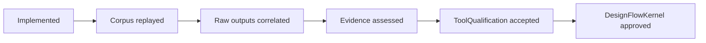

# TimingEngine Release Milestones

## Evidence path

TimingEngine owns the path through `Assessed`. The last two transitions are external policy decisions.

## Milestone matrix

| ID | Scope | Exit criteria | Status |
|---|---|---|---|
| M0 | Contract | Responsibilities and non-responsibilities are explicit | Complete |
| M1 | Canonical semantics | Standard parsers, timing IR, provenance and typed unsupported semantics | Complete for declared subset |
| M2 | Retained corpus | Positive, blocked and SI cases replay deterministically | Complete |
| M3 | Independent correlation | Native and external raw outputs are workspace-bound and reconstructed | Complete for retained Sky130A/OpenSTA profile |
| M4 | Evidence assessment | Outcome is derived; no persisted production verdict is trusted | Complete |
| M5 | ToolQualification handoff | Raw timing artifacts can be consumed through verified async reading | Complete |
| M6 | Runtime promotion | ToolQualification validation plus DesignFlowKernel policy/approval | Runtime responsibility |

## Known blockers

- Broader PVT, library-family, SPEF and SI corpus coverage remains necessary for signoff-oriented use.
- The independent OpenSTA executable is an environment prerequisite.
- Foundry rule/equivalence evidence is outside this package.
