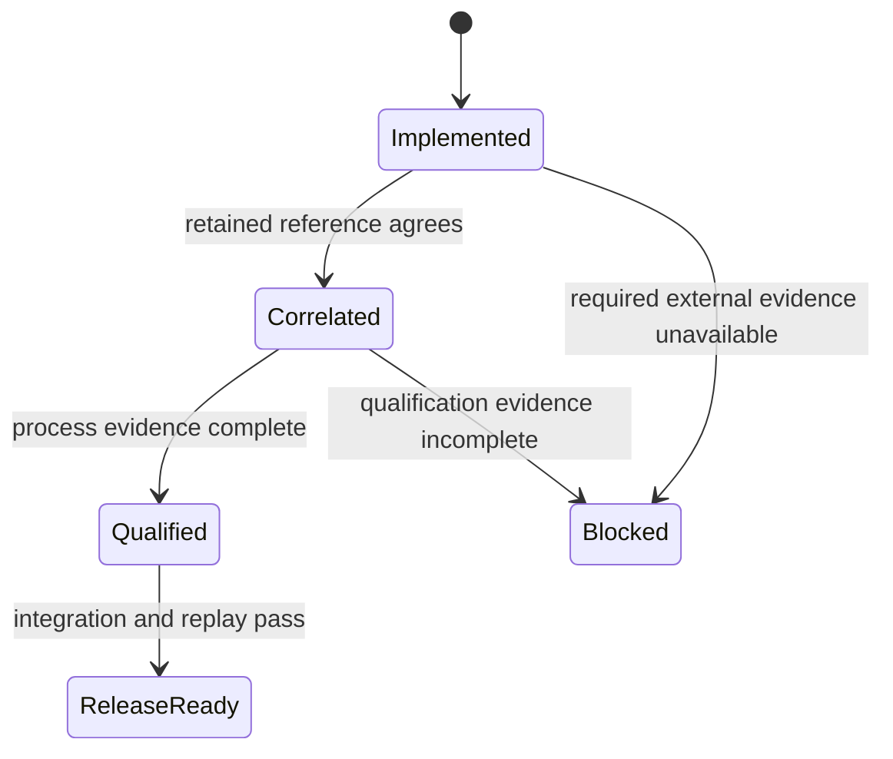

# TimingEngine Release Milestones

This document defines the release path for TimingEngine. A milestone is complete only when its implementation, retained evidence, and reproducible verification are present.

## North-star release contract

```mermaid
flowchart LR
    Canonical["Canonical timing state"] --> Parse["Standard parsers"]
    Parse --> Analyze["MMMC STA / SI"]
    Analyze --> Evidence["Retained corpus + diagnostics"]
    Evidence --> Correlate["Independent oracle correlation"]
    Correlate --> Qualify["PDK/process qualification"]
    Qualify --> Headless["Xcircuite headless flow"]
    Headless --> Review["Human review / resume artifacts"]
    Review --> Release["Release gate"]
```

## Milestone matrix

| ID | Scope | Exit criteria | Status |
|---|---|---|---|
| M0 | Scope and acceptance contract | Public responsibilities, non-goals, and release gates are written and testable | Complete |
| M1 | Canonical timing semantics | Standard input/output identities, provenance digests, path groups, clock groups, power metadata, backward-compatible payload decoding, and typed unsupported semantics are covered by tests | Complete |
| M2 | Retained corpus | Positive, negative, blocked, and SI cases are versioned with a manifest and deterministic CLI/test replay artifacts | Complete |
| M3 | Independent oracle correlation | Scalar reference and external-process adapters compare identical payloads with explicit slack, mode, corner and provenance tolerances | Contract and local reference complete; external execution evidence blocked |
| M4 | Process qualification | PDK manifest validity, required asset digests, corner/mode matrix, corpus pass rate and oracle evidence produce a retained qualification decision | PDK evidence complete; oracle gate blocked |
| M5 | Xcircuite headless integration | Timing STA and SI stages execute through typed flow inputs, persist artifacts, expose review gates, and support resume/replay | Complete |
| M6 | Release gate | Package builds, focused tests, CLI replay, corpus replay, qualification decision, and integration evidence all pass | Blocked by external/process qualification |

## Gate policy

The following states are intentionally distinct:

- `Implemented` means the native backend and typed contract are present.
- `Correlated` means an independent reference has passed for the declared scope.
- `Qualified` means a named PDK/process scope has retained evidence.
- `ReleaseReady` is not allowed while an external oracle or process gate is merely assumed.
- `Blocked` is a structured release state with a reason and next action, not a successful result.

## Immediate execution order

1. Complete M1 provenance and canonical semantic gaps. **Done**
2. Implement M2 manifest-driven retained corpus and replay artifacts. **Done**
3. Implement M3 independent reference correlation and explicit external-oracle availability. **Local reference done; external evidence pending**
4. Implement M4 process qualification evidence and decision logic. **Decision logic done; process evidence pending**
5. Complete M5 STA/SI headless integration, review artifacts, and resume coverage. **Done**
6. Run M6 as a release audit and update `GOAL_STATUS.md` with evidence paths.

## Current known release blockers

- No external digital STA oracle is installed in the local environment.
- No process-specific PDK timing corpus has been retained yet.
- The public source repository still uses workspace-local path dependencies; standalone clone packaging is not release-ready.
- The native backend must not be described as signoff-qualified until M3 and M4 evidence exists.
