# TimingEngine

Canonical timing data, MMMC static timing analysis, signal integrity, retained evidence and process-aware qualification contracts.

## Status

This package provides a local native implementation for a standards-constrained timing subset. It parses Liberty, SDC, SDF and SPEF artifacts, runs MMMC setup/hold analysis, evaluates coupling-aware signal integrity, retains provenance-bound corpus evidence and emits structured result envelopes.

The release path is deliberately explicit:

```mermaid
flowchart LR
    Inputs["LIBERTY / SDC / SPEF / design IR"] --> IR["Canonical timing IR"]
    IR --> Analysis["MMMC STA + signal integrity"]
    Analysis --> Evidence["Corpus + diagnostics + provenance"]
    Evidence --> Oracle["Reference / external oracle correlation"]
    Oracle --> Qualification["PDK/process qualification"]
    Qualification --> Flow["Xcircuite headless stage"]
    Flow --> Review["Review / approve / resume"]
```



Native implementation, retained replay, headless integration and a reproducible Sky130A qualification profile are available locally. External-oracle execution and process qualification remain explicit evidence gates and are never inferred from native results alone.

## Products

| Product | Responsibility |
|---|---|
| `TimingCore` | Liberty, SDC, SDF, SPEF, provenance and canonical timing references |
| `STAEngine` | MMMC setup and hold analysis |
| `SignalIntegrityEngine` | Coupling-aware crosstalk analysis |
| `TimingEngine` | Umbrella API, corpus replay, reference correlation and qualification decisions |
| `timingengine` | Deterministic JSON CLI |
| `opensta-oracle-adapter` | Bounded OpenSTA process adapter that emits the shared STA result envelope |

## Contract

Every executing product uses:

- a `Codable`, `Hashable`, `Sendable` request conforming to `XcircuiteEngineRequest`;
- `XcircuiteEngineResultEnvelope<Payload>` for status, diagnostics, artifacts and execution metadata;
- protocol-first dependency injection;
- immutable `XcircuiteFileReference` inputs and outputs;
- explicit blocked, failed and cancelled states.

External oracle requests use a bounded process runner. Missing executables, launch failures, timeouts, non-zero exits and invalid result envelopes remain structured diagnostics rather than hanging or being treated as correlation evidence.

## Supported standard artifacts

| Domain | Canonical input/output |
|---|---|
| Timing library | Liberty (`.lib`) |
| Constraints | SDC (`.sdc`) |
| Parasitics | SPEF (`.spef`) |
| Delay annotation | SDF (`.sdf`) |
| Design graph | JSON timing IR or structural Verilog subset |
| Result and evidence | Versioned JSON envelopes with SHA-256 provenance |

## Build

```bash
swift build

# Inspect a standard artifact
swift run timingengine parse-liberty --file path/to/library.lib

# Run native STA through the same typed API used by adapters
swift run timingengine run-sta --design design.json --library library.lib --constraints constraints.sdc --pdk-manifest pdk.json --top top

# Replay the retained corpus and write a report artifact
swift run timingengine run-corpus --manifest Corpus/timing-corpus.json --root Corpus --out /tmp/timing-corpus-report.json

# Evaluate the process qualification gate; unavailable external oracles remain blocked
swift run timingengine qualify --corpus-report /tmp/timing-corpus-report.json --pdk-manifest Corpus/fixtures/simple/pdk.json --pdk-version 1 --mode functional --corner typical

# Correlate a completed external STA envelope against a native STA envelope
swift run timingengine correlate-oracle --native-report native.json --oracle-report external.json --oracle-id opensta

# Build the independent OpenSTA adapter
swift build --product opensta-oracle-adapter

# Inspect the declared capabilities and limitations
swift run timingengine capabilities
```

`run-corpus` returns `isValid: true` only when every retained case matches its expected outcome and diagnostics. `qualify` requires PDK evidence, an available external oracle and a passing correlation report; missing correlation is a blocking finding.

## Sky130A process profile

The checked-in profile under `Qualification/sky130A` records the Sky130A TT Liberty digest, one retained DFF corpus case and the exact process/corner identity. The Liberty file itself remains an external PDK asset and is not copied into this repository.

When Volare Sky130A and an independent OpenSTA binary are available, run the complete local release audit:

```bash
OPENSTA_BIN=/path/to/sta \
SKY130_ROOT="$HOME/.volare/sky130A" \
./Scripts/qualify-sky130A.sh
```

The script produces native, external, correlation, corpus and qualification JSON artifacts under `.build/qualification/sky130A`. The external adapter retains the Liberty time unit and converts OpenSTA report values to SI seconds. The current native scalar reduction of Liberty hold constraints is correlated with a documented 1 ps tolerance for this profile; this is a release-profile tolerance, not a claim of foundry signoff equivalence.

## Workspace dependency model

TimingEngine is one package in the LSI multi-package workspace. Its manifest selects sibling packages when the complete workspace is present, and otherwise uses public revision-pinned dependencies for `XcircuitePackage`, `LogicDesign`, `PDKKit` and `SignoffToolSupport`. This keeps workspace builds on one local package identity while allowing an isolated public clone to resolve the same immutable inputs.

The pinned revisions are intentionally immutable release inputs. Updating a dependency is a deliberate manifest change followed by a fresh build, test and artifact audit.

## Test

```bash
perl -e 'alarm 30; exec @ARGV' swift test
```

The current package verification is 21 tests in 5 suites. This Swift package has no configured Xcode test scheme; SwiftPM Testing is the authoritative local test command.

## Xcircuite integration

The separate Xcircuite package provides `timing.sta` and `timing.signal-integrity` stage adapters. They resolve and digest-check project inputs, persist raw timing envelopes, expose flow gates, and preserve timing artifacts through human approval and resume.

## Release status

| Gate | Status |
|---|---|
| Native build and tests | Passed |
| Retained corpus replay | Passed |
| Local reference correlation | Passed |
| PDK manifest and required asset evidence | Passed for the retained fixture |
| External digital STA correlation | Passed for Sky130A with OpenSTA 3.1 and 1 ps tolerance |
| Sky130A process-scoped qualification | Passed for the retained Volare profile and TT corpus case |
| Foundry signoff equivalence | Not claimed; SPEF/signoff and broader PVT/library coverage remain separate gates |

See [MILESTONES.md](MILESTONES.md), [CAPABILITY.md](CAPABILITY.md) and [GOAL_STATUS.md](GOAL_STATUS.md) for the evidence boundary and release criteria.

See `DESIGN.md`, `INTERFACES.md` and `IMPLEMENTATION_PLAN.md` before implementing a backend.

See `CAPABILITY.md` for supported semantics and qualification limitations.
