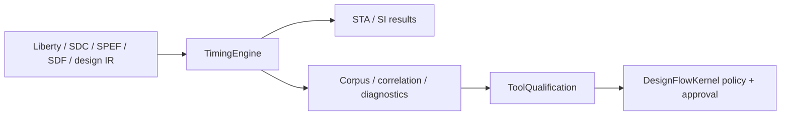
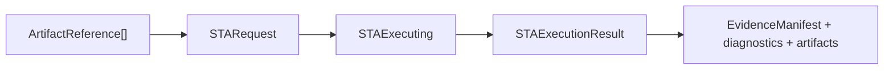

# TimingEngine

TimingEngine is a standalone Swift package for canonical timing data, MMMC static timing analysis, signal-integrity analysis and reproducible timing evidence.

## Responsibility



TimingEngine executes analyses and reconstructs retained observations. It does not declare itself production-qualified. ToolQualification validates process evidence, while DesignFlowKernel owns promotion policy and approval.

## Products

| Product | Responsibility |
|---|---|
| `TimingCore` | Liberty, SDC, SDF, SPEF, provenance and canonical timing references |
| `STAEngine` | MMMC setup and hold analysis |
| `SignalIntegrityEngine` | Coupling-aware crosstalk analysis |
| `TimingEngine` | Native engine composition, corpus replay, raw correlation and evidence assessment |
| `timingengine` | Deterministic JSON CLI |
| `opensta-oracle-adapter` | Bounded OpenSTA process integration that verifies and fingerprints the resolved executable before emitting `STAExecutionResult` |

## CircuiteFoundation conformance

STA and signal-integrity engines conform directly to CircuiteFoundation's `Engine` protocol. Requests contain immutable `ArtifactReference` values. Domain results conform independently to `ArtifactProducing`, `DiagnosticReporting` and `EvidenceProviding`.



There is no universal result envelope or runtime adapter layer.

Native engines are initialized directly. `NativeSTAEngine.capability` and
`NativeSignalIntegrityEngine.capability` expose their versioned capability
records; `TimingEngineService.nativeCapabilities` aggregates those records for
the CLI without acting as an engine factory.

## Evidence model

TimingEngine keeps three concepts separate:

| Concept | Meaning |
|---|---|
| Corpus report | Retained expected observations were replayed |
| External correlation | Raw native and independent-oracle outputs agree for a declared scope |
| Evidence assessment | Available timing observations contain no reported gap |

`TimingEvidenceAssessment.outcome` is computed from findings and is never a production qualification. A correlation report is accepted only after reopening its raw artifacts, verifying SHA-256 and byte count, checking producer and executable identity, confirming common inputs, and recomputing metrics.

All retained correlation artifacts must be workspace-relative. `--workspace-root` defines the only permitted containment boundary; symlink-resolved escapes are rejected.

## Supported artifacts

| Domain | Format |
|---|---|
| Timing library | Liberty (`.lib`) |
| Constraints | SDC (`.sdc`) |
| Parasitics | SPEF (`.spef`) |
| Delay annotation | SDF (`.sdf`) |
| Design graph | Canonical JSON IR or supported structural Verilog |
| Results and evidence | Versioned JSON with SHA-256 provenance |

`SDCParser` expands every target in a `get_ports` collection and retains binary
`set_case_analysis` constraints in the mode-specific `TimingConstraintSet`.
Duplicate assignments are normalized, while conflicting assignments in one
mode fail parsing. Input/output delays are emitted once per selected port and a
`get_clocks` option is never misclassified as a port target. Native STA
currently blocks when case analysis reaches analysis because conditional
Liberty-arc pruning is not yet implemented; it does not silently ignore the
mode constraint. Consumers such as DFTEngine own the decision about which
independently parsed modes are required for their operation.

## Build

```bash
swift build
swift run timingengine capabilities
```

## CLI

Inspect or replay standard inputs:

```bash
swift run timingengine parse-liberty --file <library.lib>
swift run timingengine run-corpus \
  --manifest <corpus-manifest.json> \
  --root <corpus-root> \
  --out <workspace-root>/corpus-report.json
```

Run native STA with workspace-relative provenance:

```bash
swift run timingengine run-sta \
  --workspace-root <workspace-root> \
  --design <workspace-root>/design.v \
  --library <workspace-root>/library.lib \
  --constraints <workspace-root>/constraints.sdc \
  --pdk-manifest <workspace-root>/pdk.json \
  --top <top-module>
```

Retain and assess independent-oracle evidence:

```bash
swift run timingengine correlate-oracle \
  --workspace-root <workspace-root> \
  --native-report <workspace-root>/native.json \
  --oracle-report <workspace-root>/oracle.json \
  --corpus-report <workspace-root>/corpus.json \
  --pdk-manifest <workspace-root>/pdk.json \
  --process <process-id> \
  --pdk-version <version> \
  --oracle-id <tool-id> \
  --oracle-version <tool-version> \
  --oracle-path <workspace-root>/tools/oracle

swift run timingengine assess-evidence \
  --workspace-root <workspace-root> \
  --corpus-report <workspace-root>/corpus.json \
  --pdk-manifest <workspace-root>/pdk.json \
  --correlation-report <workspace-root>/correlation.json \
  --oracle-id <tool-id> \
  --oracle-version <tool-version> \
  --oracle-path <workspace-root>/tools/oracle
```

The oracle executable must be retained inside the declared workspace for correlation. Availability alone is not evidence.

The OpenSTA adapter resolves symlinks, requires a regular executable file, queries `-version`, and compares the reported version with `--oracle-version`. It hashes the resolved executable with SHA-256, then prepares the executable and every declared input in a private sibling directory. Only after every snapshot passes integrity verification is that directory atomically committed as the create-only directory `<workspace-root>/.timingengine/runs/<run-id>/opensta/`. Failed preparation removes the private directory and does not consume the run ID, so the same request can be retried after its input problem is corrected. OpenSTA receives only committed snapshot paths. Generated Tcl, stdout, stderr, and input references are retained in the same run directory; executable and input bytes are verified again after analysis. The measured executable digest is recorded in `ExecutionProvenance.supportingTools[].build`. An invalid run ID, reused committed workspace, version mismatch, unreadable binary, or snapshot mutation produces a failed `STAExecutionResult` with a structured diagnostic and a nonzero process exit.

The adapter is a separate executable and requires an explicit workspace root:

```bash
swift run opensta-oracle-adapter \
  --run-id <stable-run-id> \
  --workspace-root <workspace-root> \
  --sta <workspace-root>/tools/opensta \
  --oracle-version <version> \
  --design <workspace-root>/design.v \
  --library <workspace-root>/library.lib \
  --constraints <workspace-root>/constraints.sdc \
  --pdk-manifest <workspace-root>/pdk.json \
  --top <top-module>
```

## Sky130A retained profile

The repository contains a narrow Sky130A TT input profile and a reproducible script. It does not contain retained qualification evidence. The exact PDK Liberty asset and OpenSTA executable are external prerequisites and are copied into a temporary evidence workspace before execution. Their declared SHA-256 digests and byte counts are verified; a missing or different asset is a blocked input, never a passing profile.

```bash
OPENSTA_BIN=<opensta-executable> \
SKY130_ROOT=<sky130A-root> \
./Scripts/qualify-sky130A.sh
```

The script writes raw native output, raw oracle output, correlation, corpus and evidence-assessment artifacts. ToolQualification must independently reconstruct trust from those retained bytes. These artifacts demonstrate the selected profile only; they do not establish foundry signoff equivalence.

## Test

```bash
xcodebuild test \
  -scheme TimingEngine-Package \
  -destination 'platform=macOS' \
  -parallel-testing-enabled NO
```

Use an external 30-second timeout and run focused suites when diagnosing failures.

## Integration

TimingEngine is independently usable through its typed API and CLI. A runtime such as Xcircuite may resolve project inputs, invoke the same engine protocols and persist results. ToolQualification performs process-evidence validation, and DesignFlowKernel owns policy, approval and resume.

## Current limitations

- The native backend implements a deterministic standards-constrained subset.
- Advanced statistical variation and waveform-resolved crosstalk are not implemented.
- The Sky130A retained profile covers a narrow TT scope.
- Foundry signoff equivalence is not claimed.

See `DESIGN.md`, `INTERFACES.md`, `CAPABILITY.md`, `MILESTONES.md` and `GOAL_STATUS.md` for the complete contracts and status.
